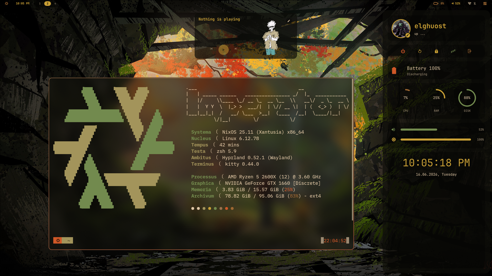
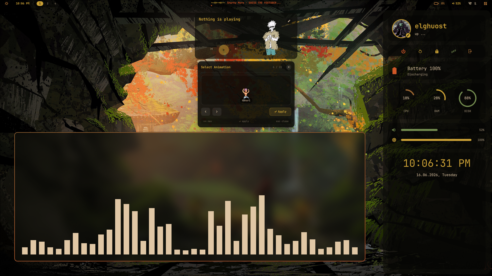
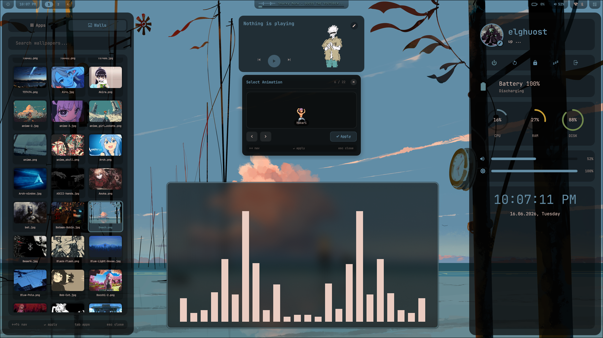
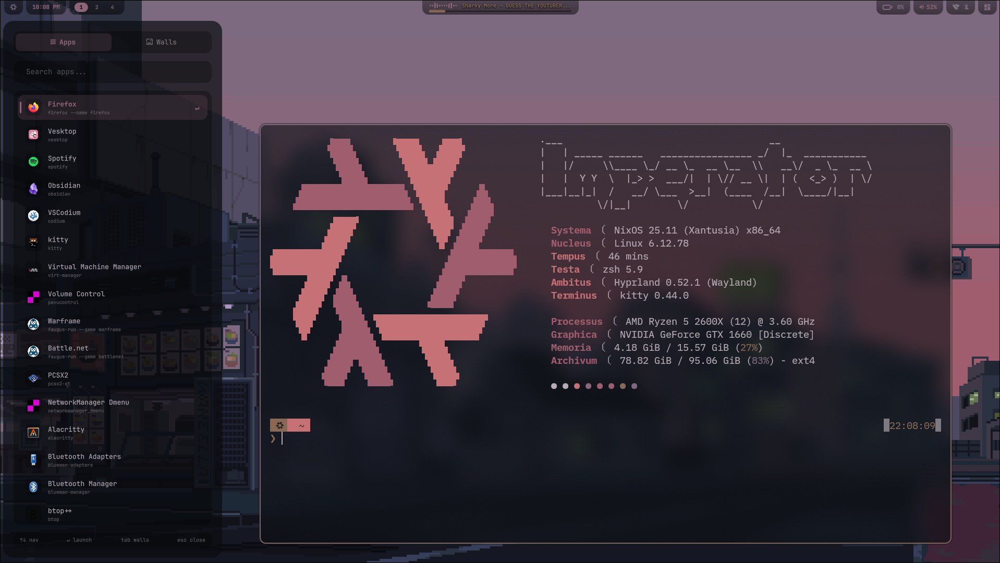

# I use nixos btw
## Dotfiles NixOS + Hyprland

Mes premiers pas dans le ricing sous NixOS. C'est un setup en construction, loin d'être parfait, mais j'apprends en faisant.

L'idée : une config reproductible avec un shell de bureau maison écrit en QML via Quickshell.


---

## Aperçu

| | |
|:-:|:-:|
|  |  |
|  |  |

L'interface se recolore dynamiquement selon le wallpaper choisi.

---

## Le setup

**Système** : NixOS 25.11 (Xantusia) avec Home Manager en flakes

**Compositeur** : Hyprland , tiling, animations, Wayland natif

**Shell de bureau** : Quickshell , barre, sidebar, launcher, panneaux écrits en QML. C'est la partie où j'ai le plus expérimenté.

**Barre alternative** : Waybar en backup

**Launcher** : Rofi (wayland) , apps et sélection de wallpapers

**Terminal** : kitty / Alacritty

**Shell** : zsh avec un prompt custom

**Autres** : fastfetch (labels latins custom), spicetify pour Spotify, btop

---

## Ce que j'ai fait moi-même

### Quickshell (`home/quickshell/`)

Environnement construit en QML au lieu de configurer un bar existant.

- `Bar.qml` , barre supérieure avec workspaces, horloge, tray
- `Dashboard.qml` , sidebar droite : profil, boutons power, jauges CPU/RAM/DISK, sliders volume/luminosité
- `LauncherPanel.qml` , launcher avec onglets Apps/Walls et aperçus de wallpapers
- `MusicPanel.qml` , lecteur "Now Playing" avec visualiseur audio
- `WifiPanel.qml` / `BluetoothPanel.qml` , gestion réseau et Bluetooth
- Mascotte animée pixel-art avec sélecteur d'animations

### Scripts (`home/scripts/`)

Quelques scripts utilitaires :
- `random-wallpaper.sh` , change le wallpaper et régénère la palette
- `Music.sh` , contrôle playerctl
- `define.sh` , dictionnaire en CLI

### Thème dynamique

La palette est extraite du wallpaper et propagée à Hyprland, Quickshell, kitty, Rofi et Spotify. C'est ce qui permet les variations de couleurs qu'on voit entre les différents wallpapers.

---

## Structure

```
dotfiles/
├── home/                      # configs utilisateur
│   ├── hypr/                  # hyprland.conf, monitors.conf
│   ├── kitty/
│   ├── quickshell/            # le shell QML
│   ├── rofi/
│   ├── waybar/
│   └── scripts/
│
├── nixos/                     # config système
│   ├── flake.nix
│   ├── home.nix
│   └── modules/               # boot, GPU, audio, network, etc.
│
└── assets/
    └── screenshots/
```

---

## Installation

C'est ma config perso, taillée pour ma machine (Ryzen 5 2600X / GTX 1660). Si tu veux t'en inspirer, regarde bien `modules/graphismes.nix` et `modules/boot.nix` avant de rebuild.

```bash
git clone https://github.com/elghuost/Dotfiles.git ~/dotfiles
cd ~/dotfiles

# Adapter hostname/utilisateur dans flake.nix
# Copier ton hardware-configuration.nix

sudo nixos-rebuild switch --flake .#<ton-host>
```

---

## Ma machine

```
Systema   NixOS 25.11 (Xantusia) x86_64
Nucleus   Linux 6.12.78
Ambitus   Hyprland 0.52.1 (Wayland)
Processus AMD Ryzen 5 2600X (12) @ 3.60 GHz
Graphica  NVIDIA GeForce GTX 1660
Memoria   15.57 GiB
```

---

## Crédits

- Quickshell par outfoxxed
- La communauté r/unixporn et r/NixOS pour l'inspiration

---

*Mes débuts dans le ricing , suggestions bienvenues.*
